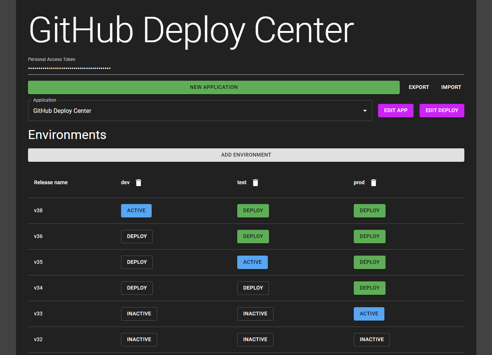

# GitHub Deploy Center (GDC)

GDC is a static website for showing your GitHub releases and deployments, and provides one-click deployment to any environment, powered by -your- GitHub Action workflows.

- GDC is a fully static website and uses only local storage. No cookies, and nothing is sent to any server!
- Application settings can be exported, shared and imported.
- Monorepos are supported, with a flexible configuration flow for multiple applications in the same repo.

## Getting started

To use GDC, you need a couple of things:

- A GitHub Personal Access Token with the `repo` OAuth scope. You can create one [here](https://github.com/settings/tokens).
- A way to create GitHub releases (preferrably automatically, e.g. through GH Actions). See [the GDC Build and Publish workflow](./.github/workflows/build-and-publish.yml) as an example.
- A GitHub Workflow for **deployment** with the `workflow_dispatch` trigger.
  - The workflow must accept the following inputs (names are customizable):
    - `ref`: Which release version to deploy (e.g. v1.0.3)
    - `environment`: Which environment to deploy to (e.g. dev, test or prod)
  - The workflow must create a deployment for the same commit as the release, and update status on success or failure.
  - See [the GDC Deploy workflow](./.github/workflows/deploy.yml) as an example.

## Hosting

The app is hosted in Azure at https://githubdeploy.z1.web.core.windows.net/, and will be kept updated to the latest version. If you want to host it yourself, you can build it for production with `yarn build`, then host the resulting static assets in `build/` anywhere you like, e.g. Azure Blob Storage, Heroku, Google Cloud Storage.

# Development

The app is built with:

- [Create React App](https://create-react-app.dev/)
- [Material UI](https://material-ui.com/)
- [Overmind](https://overmindjs.org/)
- [React Query](https://@tanstack/react-query.tanstack.com/)
- [GraphQL](https://graphql.org/)

## Available Scripts

In the project directory, you can run:

### `yarn start`

Runs the app in the development mode. 
Open [http://localhost:3000](http://localhost:3000) to view it in the browser.

The page will reload if you make edits. 
You will also see any lint errors in the console.

### `yarn test`

Launches the test runner in the interactive watch mode. 
See the section about [running tests](https://facebook.github.io/create-react-app/docs/running-tests) for more information.

### `yarn build`

Builds the app for production to the `build` folder. 
It correctly bundles React in production mode and optimizes the build for the best performance.

The build is minified and the filenames include the hashes. 
Your app is ready to be deployed!

See the section about [deployment](https://facebook.github.io/create-react-app/docs/deployment) for more information.

### `yarn eject`

**Note: this is a one-way operation. Once you `eject`, you can’t go back!**

If you aren’t satisfied with the build tool and configuration choices, you can `eject` at any time. This command will remove the single build dependency from your project.

Instead, it will copy all the configuration files and the transitive dependencies (webpack, Babel, ESLint, etc) right into your project so you have full control over them. All of the commands except `eject` will still work, but they will point to the copied scripts so you can tweak them. At this point you’re on your own.

You don’t have to ever use `eject`. The curated feature set is suitable for small and middle deployments, and you shouldn’t feel obligated to use this feature. However we understand that this tool wouldn’t be useful if you couldn’t customize it when you are ready for it.

## Learn More

You can learn more in the [Create React App documentation](https://facebook.github.io/create-react-app/docs/getting-started).

To learn React, check out the [React documentation](https://reactjs.org/).
